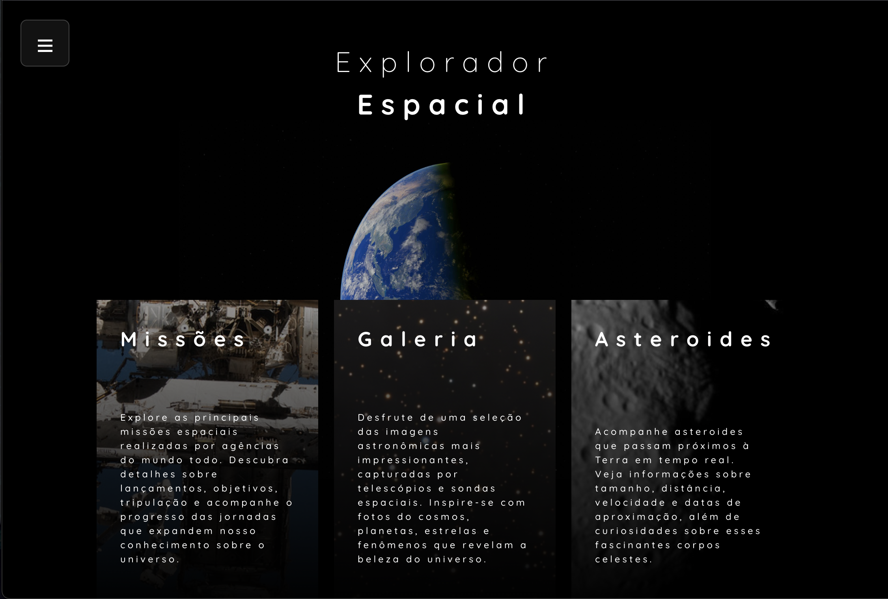
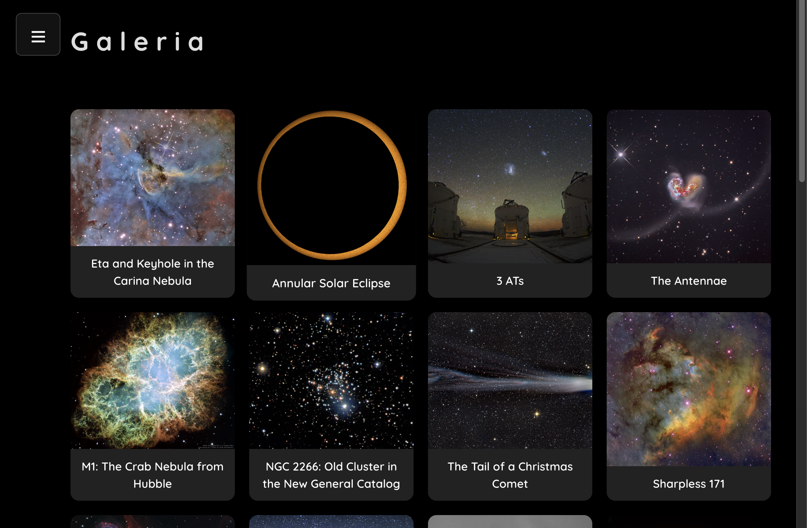
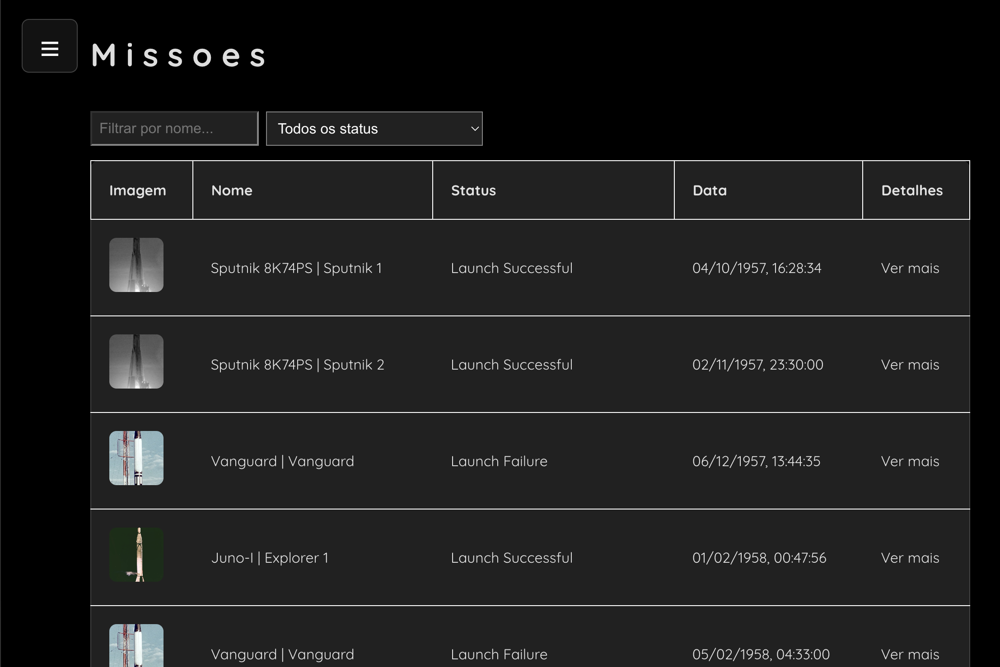
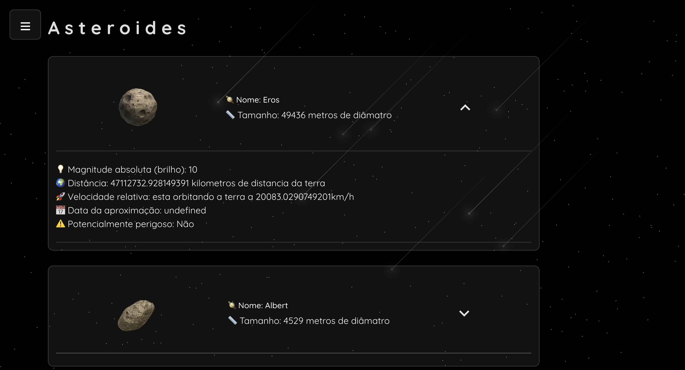

# Space Explorer 🚀

Um dashboard interativo para exploração de espaço e astronomia, desenvolvido em React + TypeScript + Vite.

## Preview

<p align="center">
  
  
  
  
</p>

## Tema do Projeto

O **Space Explorer** é um painel para explorar missões espaciais, asteroides próximos à Terra, imagens astronômicas do dia e dados de planetas. O objetivo é criar uma aplicação rica, visual e educativa, utilizando dados reais de APIs públicas como NASA e Launch Library 2.

## Funcionalidades
- **Página inicial:** Destaques do dia (imagem astronômica, missões em andamento)
- **Lista de missões espaciais:** Filtros por agência, status, ano, etc.
- **Detalhe de missão:** Informações detalhadas, tripulação, objetivos, links externos
- **Asteroides próximos à Terra:** Lista e detalhes, com filtros por tamanho, distância, data
- **Galeria de imagens astronômicas:** Carregamento sob demanda de imagens do APOD (NASA)
- **Busca e favoritos:** Salvar missões ou imagens favoritas (localStorage)

## APIs Utilizadas
- [NASA Open APIs](https://api.nasa.gov/)
  - Asteroids - NeoWs
  - APOD - Astronomy Picture of the Day
  - Mars Rover Photos
  - Exoplanet Archive
- [Launch Library 2](https://thespacedevs.com/llapi)

## Objetivo de Performance
Este projeto foi criado para **aplicar e demonstrar técnicas de performance em React**, incluindo:
- **React.memo** e **useMemo**: Memoização de listas, filtros e componentes pesados
- **useCallback**: Handlers de filtros, favoritos e busca
- **React.lazy** e **Suspense**: Code-splitting e carregamento sob demanda de páginas e componentes
- **Code-splitting**: Separação de rotas e páginas em chunks
- **Virtualização de listas** (opcional): Para listas grandes de missões ou asteroides

## Por que é diferente?
- Tem dados ricos, visuais e interativos
- Permite explorar várias técnicas de performance
- Tema interessante e educativo

## Como rodar o projeto

```bash
npm install
npm run dev
```

Acesse [http://localhost:5173](http://localhost:5173) no navegador.

---

Este projeto é um laboratório para estudo e demonstração de boas práticas de performance em aplicações React modernas.

